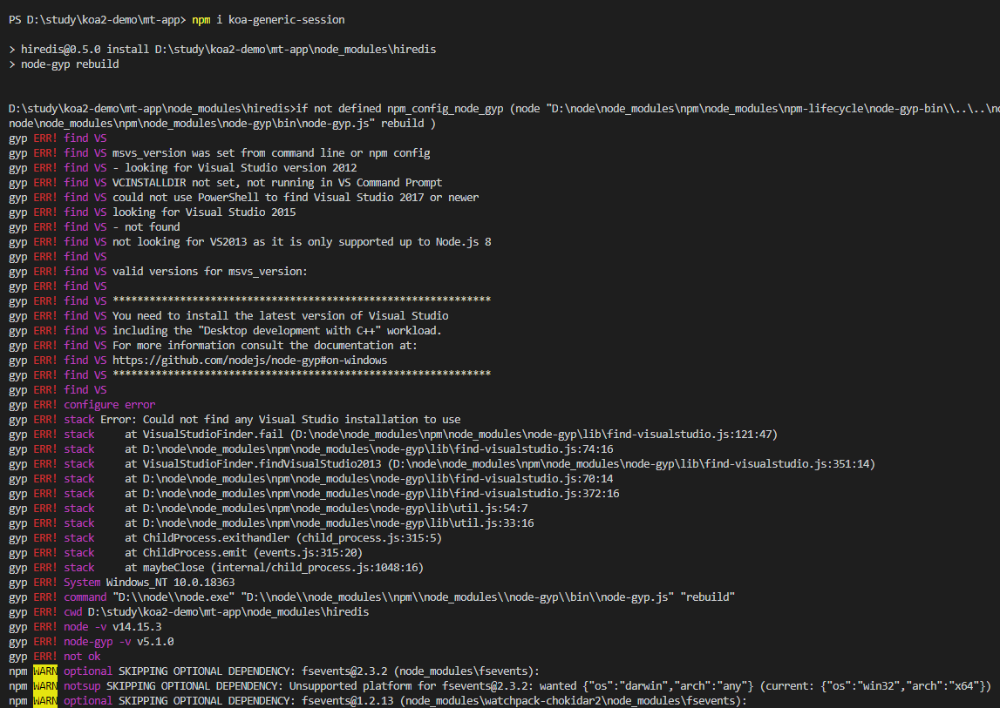
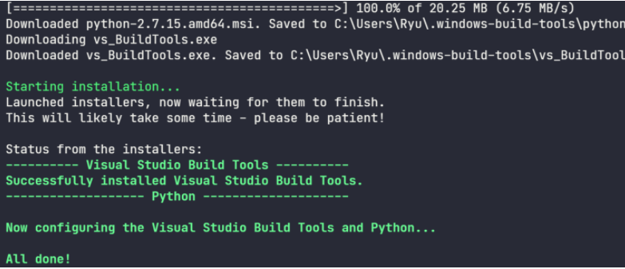

> 安装Koa插件时遇到的问题
<!--more-->

问题描述：



  电脑中缺少python环境和桌面应用程序

解决方法：
  用Powershell或者cmd 用管理员身份打开

```powershell
 npm install --global --production windows-build-tools  
```

 它会安装python 2.7 和  VisualStudio


注意

选择Visual C++生成工具

命令行执行完后请等待，此时你的C盘会有4G的占用 

当滑轮滚动命令行窗口 它不锁定  或者看到



All done!时

 方可关闭此窗口

强调！如果再安装Koa插件时依旧出现问题，那么请重复命令行操作

因为你的电脑可能因为网络问题而安装C++桌面应用程序不成功

安装过程可留意C盘的大小变化，安装成功大约占用4G内容


亲测有效！！！