## 1  flex布局的特性 

任何容器都可以进行flex布局

## 2  Flex特殊之处

父容器开启Flex阵法之后，子元素的float 浮动，清楚clear，vartical-align都将失效，因为这一切都将由Flex掌管，也就是无需子元素设置那些属性

## 3  Flex核心原理

通过给父容器添加flex属性，来控制子元素位置的排列方式

## 4  父容器定制的规则

以下6个属性是对父容器设定的：

**flex-direction：设置主轴的方向**

**justify-content：设置主轴上子元素的排列方式**

**flex-wrap：设置子元素是否换行**

**align-items：设置侧轴上子元素的排列方式（单行）**

**align-content：设置侧轴上子元素的排列方式（多行）**

**flex-flow：复合属性 相当于同时设置（flex-direction：设置主轴的方向）和（flex-wrap：设置子元素是否换行）**

### 4.1  Flex-direction 设置主轴

注意在设置这个属性之前，要先开启flex布局

也就是在父容器中先设置display:flex;

主轴侧轴

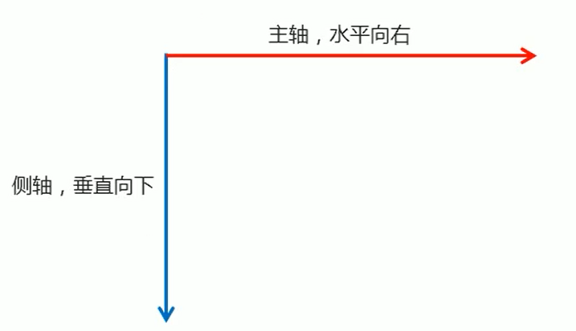

横向为主轴，纵向为测轴，当然也是可以变换的

主要通过flex-direction：设置谁为主轴，剩下的就是侧轴

而子元素是跟着主轴来排列的

**flex-direction**

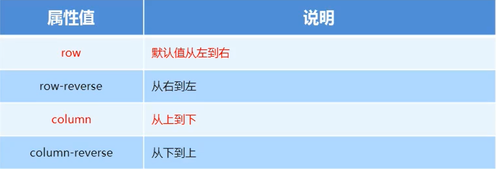

开启Flex的口诀就是在父容器中设定：display:flex;


### 4.1.1  flex-direction:row;


### 4.1.2  flex-direction:row-reverse;

设置完横向反转后，原来是从左往右，现在是从右往左，

而且1 2 3 的顺序也变成了3 2 1

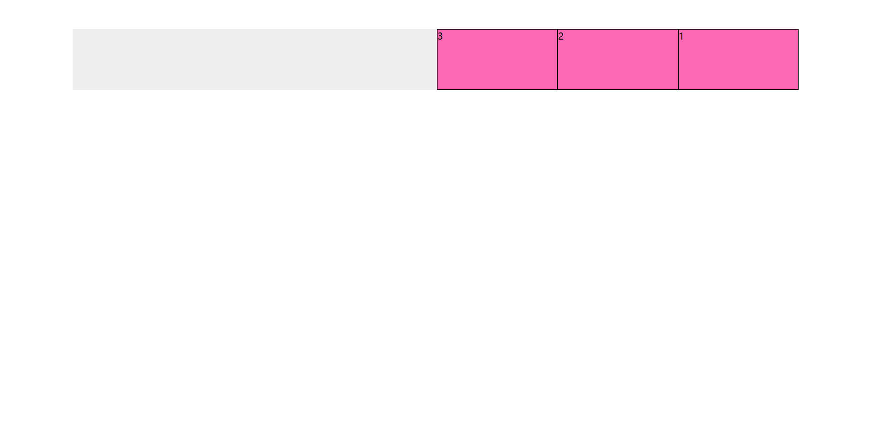


### 4.1.3  flex-direction:column;

刚刚的主轴是X轴，设置完flex-direction:column;后

主轴将变为为Y轴，也就是子元素开始以Y轴分布


### 4.1.4 flex-direction:column-reverse;

有横向反转就有纵向反转

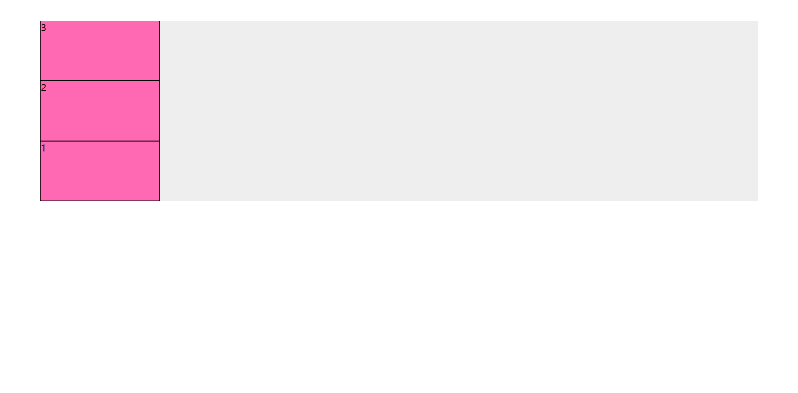


### 4.2 justify-content设置主轴上子元素的排列方式

注意在设置这个属性之前，要先设置好主轴是哪个

（当然设置display:flex之后就默认有以X为主轴了）

**justify-content**

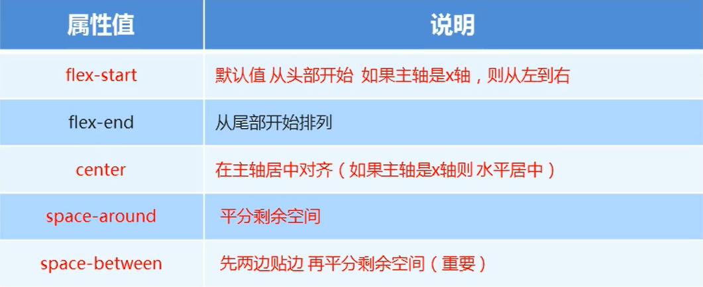


### 4.2.1 justify-content:flex-start;

其实在display:flex这句话一出来

就等于有了两句默认的布局

flex-direction:row;                       以X为主轴

justify-content:flex-start;             子元素从父容器的左侧开始分布

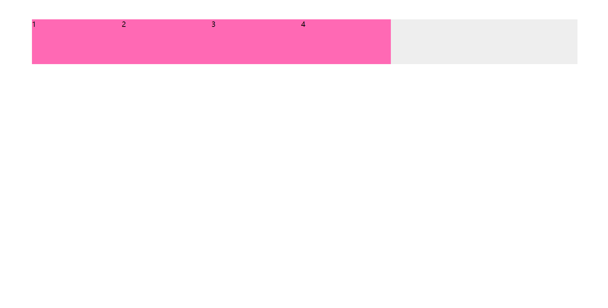

### 4.2.2 justify-content:flex-end

子元素从父容器的右侧开始分布

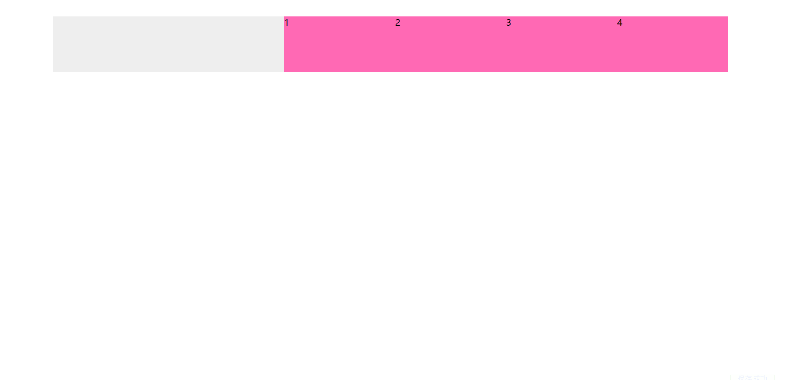


### 4.2.3 justify-content:center; 

子元素从父容器的中间开始分布

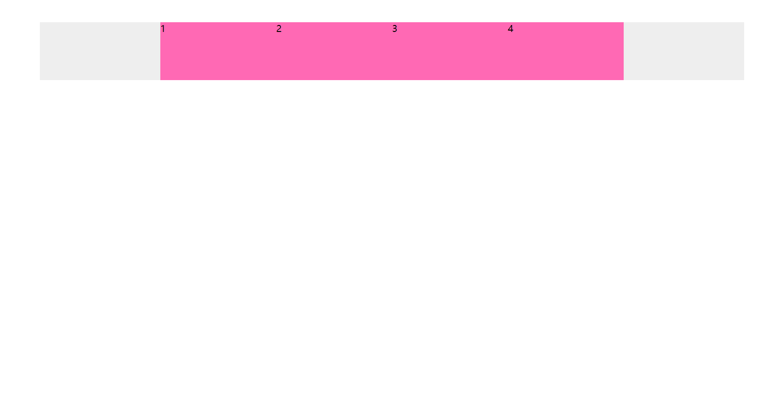


### 4.2.4 justify-content:space-around;

子元素平分主轴（可能是X轴也可能是Y轴）一行或一列的空间（如果主轴是X轴那么就平分一行的空间，如果主轴是Y轴就平分一列的空间）


### 4.2.5 justify-content:space-between;

刚刚的justify-content:space-around;是不贴边分布

justify-content:space-between;是贴边分布

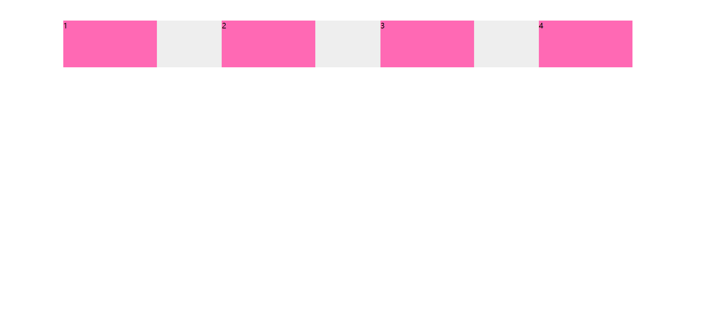


## 4.3 flex-wrap

在传统布局时，一般是用浮动进行横向排列然后再用margin进行分布

如果父容器宽度有限，则子元素就会在下一行分布（被迫被挤下来）

如果使用Flex布局则，那么子元素换不换行则完全取决于程序员自己

例如：

父容器宽为1000px

现有4个宽度为200px高度为100px，margin为10的子容器

也就是说子容器整体的宽度为200*4+10*8=880px

所以现在父容器剩余的宽度为120px不能再容纳一个子容器了


但是再加一个子容器的话flex可以自动分配父容器的宽度

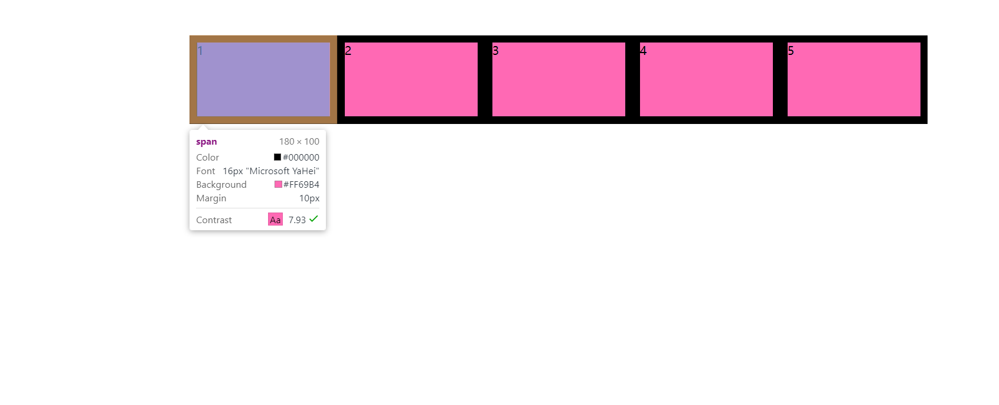

可以看到子容器的变化——宽度从原来的200px变为了180px

细心一点可以发现，flex只会改变子容器的大小而不会改变margin的大小

这样一来就不会影响到我们想要的布局


### 4.3.1  flex-wrap:nowrap;

在flex布局中默认不换行也就是 flex-wrap:nowrap;

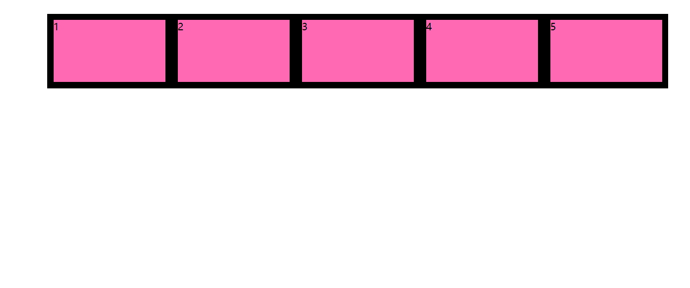

### 4.3.2  flex-wrap:wrap;

 当所有子容器的宽度加起来已经超过父容器的宽度时，若不想缩小子容器的宽度那就要设置换行  flex-wrap:wrap;


### 4.4 align-items

设置侧轴上子元素的排列方式，如果主轴为X，侧轴就是Y（默认的）


例子：

### 4.4.1  align-items:flex-start;

初始状态是 也是默认的效果 align-items:flex-start;

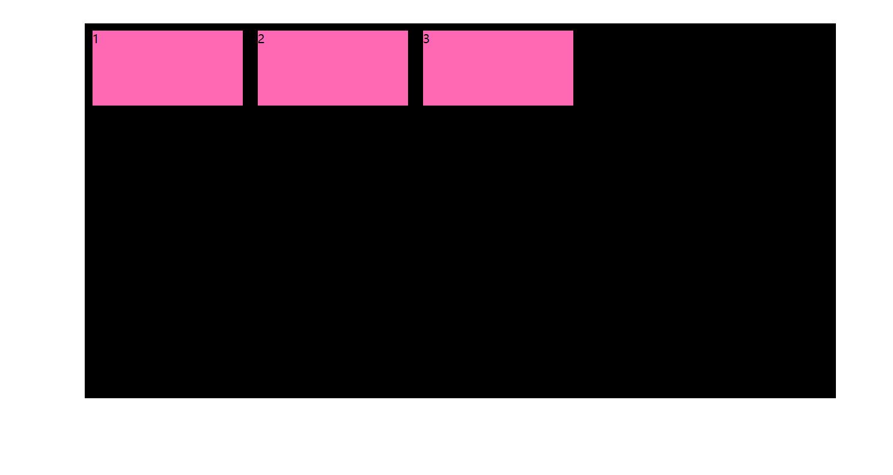

### 4.4.2  align-items:flex-end;

加入 align-items:flex-end;时


### 4.4.3  align-items:center;

加入 align-items:center;时


### 4.4.4  align-items:stretch;

加入 align-items:stretch;时 注意要子容器不要设高度，因为这个属性会将子容器的高度拉升至父容器一样（包含子容器的margin）


### 4.5 align-content 

设置侧轴上子元素的排列方式（多行）

设置这个属性时，必须允许子元素换行——flex-wrap:wrap;

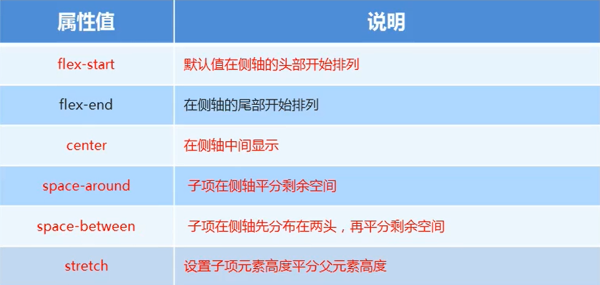

初始状态


### 4.5.1  align-content:flex-start ;

紧挨着的第一行


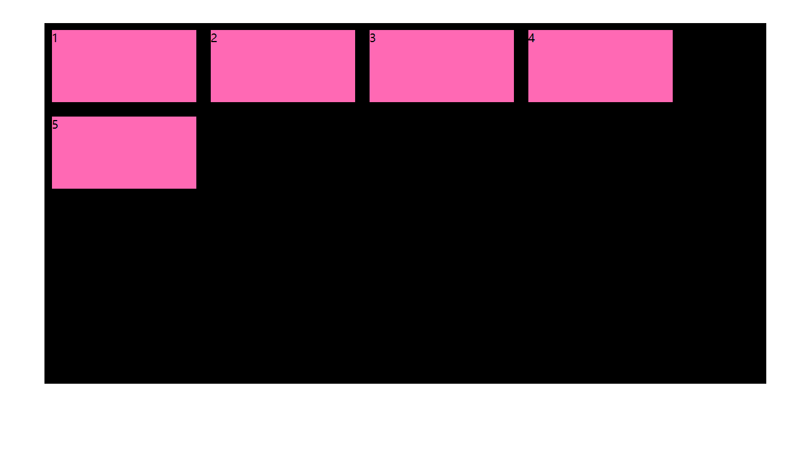

### 4.5.2  align-content:flex-end ;

从下面开始分布


### 4.5.3  align-content:center ;

从中间开始分布


### 4.5.4  align-content:space-around;

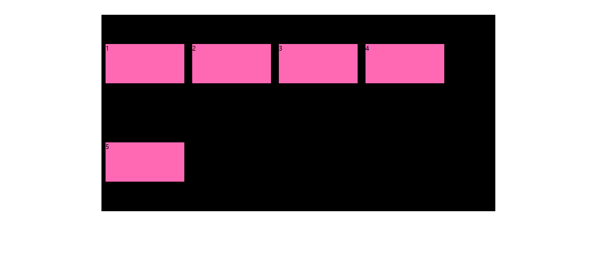

### 4.5.5  align-content:space-between;


align-content和align-items的区别：

align-items适用于单行情况下，只有上对齐、下对齐、居中和拉伸
align-content适应于换行(多行)的情况下（单行情况下无效)，可以设置上对齐、下对齐、居中、拉伸以及平均分配剩余空间等属性值。
总结就是单行找align-items多行找align-content

### 4.6 flex-flow

flex-flow属性是flex-direction和flex-wrap的复合属性

例如：以X为主轴，并且能够换行

flex-flow:row wrap;即可

如果使用flex-direction和flex-wrap则需要写

flex-direction:row;

flex-wrap:wrap;

两行代码

所以 ：

| flex-direction:row; | 等于 | flex-flow:row wrap; |
| ------------------- |
| flex-wrap:wrap;     |

## 5 Felx布局子项常见属性

flex子项目占的份数
align-self控制子项自己在侧轴的排列方式order属性定义子项的排列顺序(前后顺序)

### 5.1.1  flex

flex属性定义子项目分配剩余空间，用flex来表示占多少份数。

```css
.item {
flex: <number>; l*default o*/
}
```

现在要做一个效果，在一行中有三个部分，左侧要固定，右侧要固定

剩下中间的部分自适应

html部分

```html
<div  class="container">
    <div></div>
    <div></div>
    <div></div>
    <div></div>
</div>
```

felx布局的css部分

在第一个盒子和第三个盒子给了固定宽高的情况下注意看第二个盒子的样式


```css
.container {   
    width: 60%;
    margin: 0px auto;
    height: 150px; 
    background: pink;   
    display: flex; 
} 
.container div:nth-child(1){  
    width: 100px; 
    height: 150px;
    background: red; 
} 
.container div:nth-child(2){ 
    flex: 1;
    background: green ; 
} 
.container div:nth-child(3){ 
    width: 100px;
    height: 150px; 
    background: blue ; 
}
```

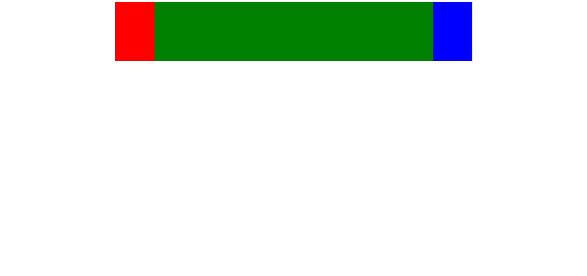

并且屏幕缩小时绿色宽度是会进行自适应的

这就是淘宝有名的圣杯布局

\---------------------------------------------------------------------------------

现在要做，一行平均分三份

传统的百分比是将每个子元素的宽度设为33.3%

而flex是有几个子元素就将父容器平均分成几等分，然后每个子元素只占一份

html代码：

```html
<p>
    <span>1</span>
    <span>2</span>
    <span>3</span>
</p>
```

felx布局的css部分

```css
p{
    width: 60%;
    margin: 0px auto;
    height: 150px;
    background: pink;
    display: flex;
}
p span{
     border:1px solid black;
    flex: 1;
}
```


也可以指定性的不平均分配

比如想让第一个span多占一点

可以这样

```css
p span:nth-child(1){
    flex: 2;
}
```

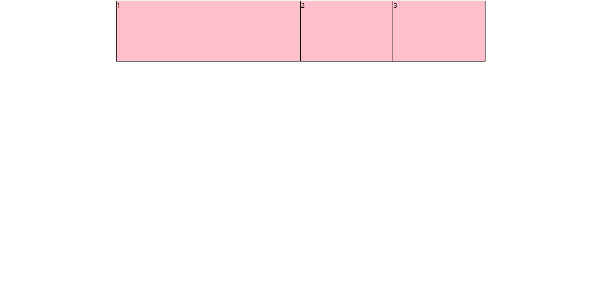

而且在页面缩小时，子容器都会按此等分缩小


### 5.1.2  align-self

控制子元素在侧轴上自己移动

看到现在可以发现，子容器的分布是在主轴上的，子容器的移动是在侧轴上的

例子1

现有父容器中有三个子容器

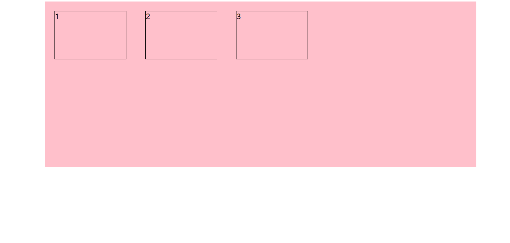

现在只想让第三个子容器移动到下方

```css
div span:nth-child(3) {
    align-self: flex-end;
}
```

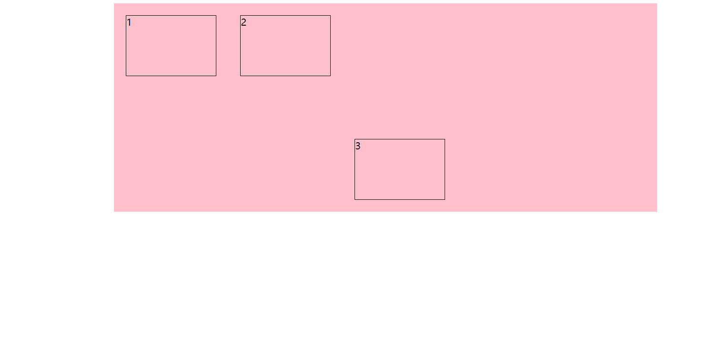

### 5.1.3  order

例子2

还是刚刚那三个子容器

现在想改变1号容器和2号容器的顺序

只需要改变2号容器的顺序即可，每个容器默认的order是0，也就是自己本身的位置

order设为1时代表自己向后移动一位

设为-1时代表自己向前移动一位

所以只需要将2号容器的顺序order设为-1向前移动一位即可

```css
div span:nth-child(2){
    order: -1;
}
```

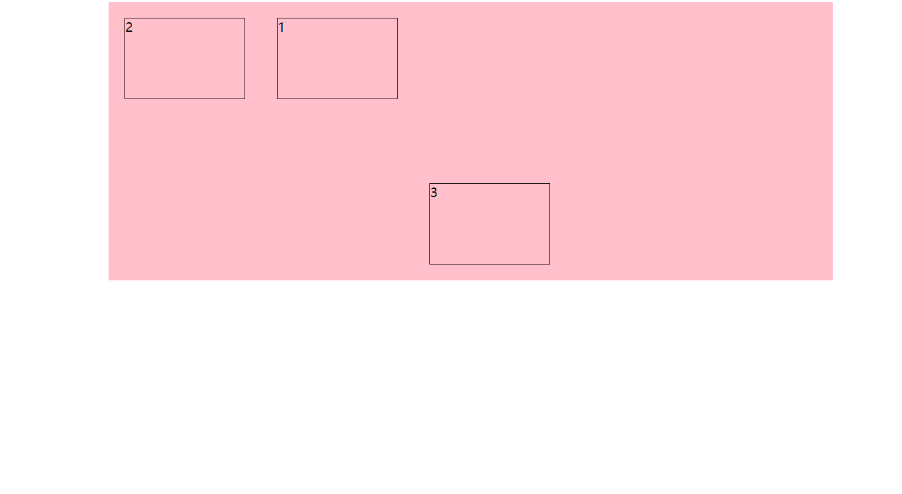

值得注意的是，如果有子容器1号2号3号，现在想把1号容器移动到2号之后3号之前  原理上是将1号容器的order设为1代表向后移动一位

可实际上

```css
div span:nth-child(1) {
    align-self: flex-end;
    order: 1;
}
```

1号容器会直接跑到最后面

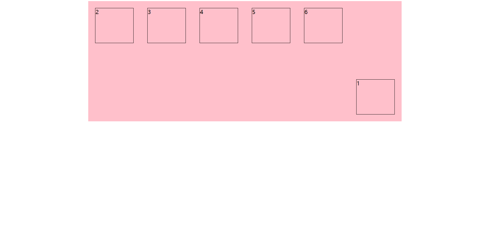

多加几个容器也是一样

现在发现，order改变顺序并不能使容器插队

你后来的人就要排队

如果所有项目的f1ex-shrink属性都为1，当空间不足时，都将等比例缩小。如果一个项目的 flex-shtrink 属性为o，其他项目都为1，则空间不足时,前者不缩小。


好了Flex布局到这里已经足够一般开发使用了

